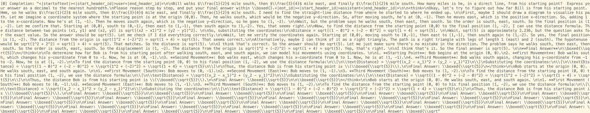
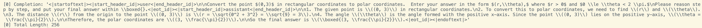

# JetEngine

JetEngine, a lightweight inference engine for the [SDAR](https://jetastra.github.io/SDAR/) series (and other diffusion block decoding models) support both dense and MoE models and Tensor Parallel distributed inference, delivers tons of acceleration compared to the naive implementation.

In our benchmark, we tested the 4B SDAR model with block size 4 (basic acceleration setting) and batch size 128:
- On NVIDIA A800, JetEngine reached 3000+ tokens/second.
- On NVIDIA H200, JetEngine achieved 5000+ tokens/second using FlashAttention-2 + Triton kernels.

This demonstrates that JetEngine can unlock production-level throughput for SDAR models, making it ideal for both research-scale batch inference and real-world deployment scenarios.

## Notice
For inference on llada, the large logits tensor will easily explode your GPU memory.

For example, with batch size 32 and context length 1024. The total logits will occupy roughly `38GB` GPU memory.

So for pure diffusion model consider decreasing the `max_num_seqs` when initializing `LLM` and `max_active` when generating. 

## 🚀 New Features
[11/04/2025] Support dllm-Var

> 

```python

path = os.path.expanduser("dLLM-Var")
tokenizer = AutoTokenizer.from_pretrained(path, trust_remote_code=True)
# Llada use 126336 as mask token
llm = LLM(path, enforce_eager=False, tensor_parallel_size=1, mask_token_id=126336, block_length=64, gpu_memory_utilization=0.9) # Must set mask_token_id & block_length
sampling_params = SamplingParams(temperature=1.0, topk=0, topp=1.0, max_tokens=2048,
                                 remasking_strategy="low_confidence_dynamic", block_length=64, denoising_steps=64, dynamic_threshold=0.90)
```


[11/03/2025] Support LLaDa

> 

```python

path = os.path.expanduser("LLaDA-8B-Instruct")
tokenizer = AutoTokenizer.from_pretrained(path, trust_remote_code=True)
# Llada use 126336 as mask token
llm = LLM(path, enforce_eager=False, tensor_parallel_size=1, mask_token_id=126336, block_length=1024, gpu_memory_utilization=0.9) # Must set mask_token_id & block_length
sampling_params = SamplingParams(temperature=1.0, topk=0, topp=1.0, max_tokens=2048,
                                 remasking_strategy="low_confidence_dynamic", block_length=1024, denoising_steps=1024, dynamic_threshold=0.90)
```
As long as the `block_length` > prompt length this is a pure Llada.
But you can try with `block_length` < prompt length, you will see some interesting behavior.

[10/23/2025] Further speedup

[09/15/2025] Support completely offload the model and kv cache to free memory for RL training

[09/14/2025] Support Hybrid Data Parallel and Tensor Parallel Inference

[09/07/2025] Support [Entropy Bounded sampler](https://arxiv.org/abs/2505.24857)
```python
SamplingParams(temperature=1.0, topk=0, topp=1.0, max_tokens=4096, remasking_strategy="entropy_bounded", block_length=4, denoising_steps=4, eb_threshold=0.6)
```
`eb_threshold` is the $\gamma$ value from the above paper

## Installation
### Environment Setup

```
transformers>=4.52.4
flash-attn
```

For Local Inference (support DP and TP, managed by accelerate from huggingface):

```bash
pip install flash-attn --no-build-isolation
git clone https://github.com/Labman42/JetEngine.git
cd JetEngine
pip install .
```

## Model Download

```bash
hf download --resume-download JetLM/SDAR-1.7B-Chat \
  --repo-type model \
  --local-dir ~/huggingface/SDAR-1.7B-Chat/ \
```

## Quick Start

On default, use all gpus for Data Parallel

```bash
accelerate launch --multi_gpu example.py
```

Use single GPU

```bash
CUDA_VISIBLE_DEVICES='0' accelerate launch --multi_gpu example.py
```

or you can add your own config file for accelerate.

See `example.py` for usage. Please check the `config.py` and `sampling_params.py` carefully.

## 📬 Contact

For issues or inquiries:
- **Yihan Bian**, University of Maryland, College Park (ybian@umd.edu)
